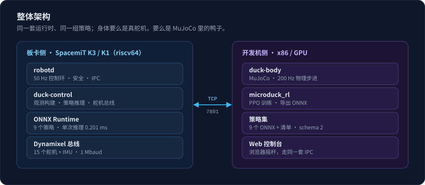
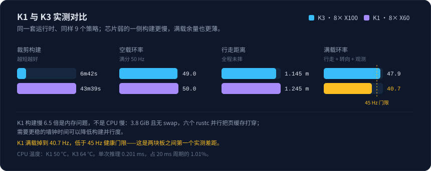
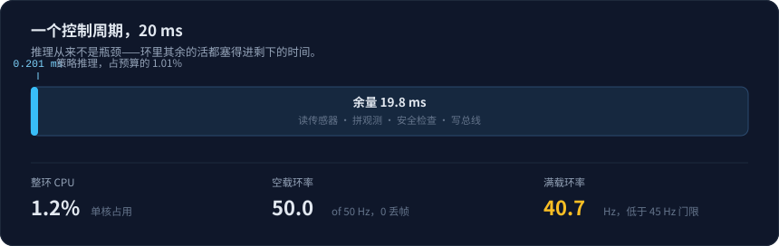
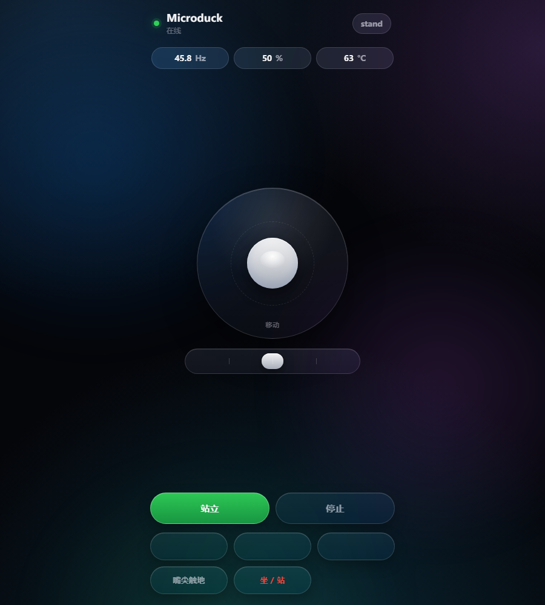
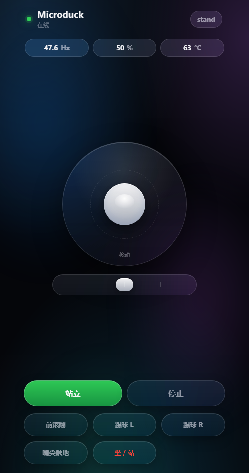
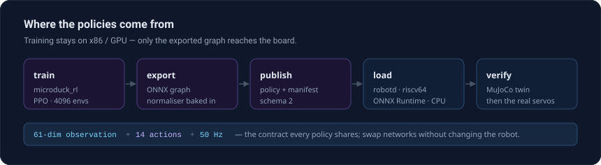

<div align="center">

# spacemit-microduck

**Running Microduck's robot runtime natively on SpacemiT RISC-V.**

[](microduck/LICENSE)
[](#status)
[](#status)
[](#measurements)

</div>

---

Microduck is a 25 cm bipedal robot driven by reinforcement-learning policies. Its runtime is a
Rust workspace: a 50 Hz control loop, an ONNX policy executor, a servo bus, and the surrounding
daemons. This repository ports that runtime to SpacemiT RISC-V SoCs and drives a robot with it,
keeping the training and simulation chain on x86/GPU as before.



## Status

| | K3 | K1 |
|---|---|---|
| SoC | 8x X100 @2.4 GHz, 60 TOPS NPU | 8x X60 @1.8 GHz, 2 TOPS (CPU fused) |
| Board | K3 Pico-ITX | MUSE-Pi-Pro |
| Role | compute reference | integration form factor |
| Result | works | works |

Both boards build the runtime natively, load the nine shipped ONNX policies, and drive a duck in
MuJoCo through sit-to-stand, walking, and turning without falling.



## Measurements



<details>
<summary>K3 — full record</summary>

| Metric | Value |
|---|---|
| Trimmed build | 6m42s, seven riscv64 binaries |
| Policies loaded | 9 official ONNX, via SpacemiT ONNX Runtime 1.24.2 |
| Motion | sit-to-stand (z 0.065 -> 0.116), 7 s standing, 1.45 m walking |
| Control loop | 46-48 of 50 Hz, 0 missed ticks |
| Single inference | 0.201 ms (p99 0.223) — 1.01% of the 20 ms tick |
| Whole-loop CPU | about 1.2% of one core |
| Velocity tracking | 0.097 m/s against a 0.25 m/s command (sim-to-sim gap) |

</details>

<details>
<summary>K1 — full record</summary>

| Metric | Value |
|---|---|
| Trimmed build | 43m39s, 313 crates, `robotd` 7.3 MB |
| Idle loop | 50.0 of 50 Hz, 0 missed ticks |
| Motion | sit-to-stand, 1.245 m walking, turning, no falls |
| Control loop (with simulator) | 46.5-48.5 of 50 Hz |
| Control loop (fully loaded) | 40.7 Hz — below the 45 Hz health floor |
| CPU temperature | 50 C |

</details>

The full records, including reproduction commands and the traps each one cost, are in
[`docs/`](docs).

## Driving it from a browser

The same console runs on the board and drives the duck over the daemon's IPC — a joystick,
the one-shot skills, and live posture and health. It holds no robot state of its own: the drive
stream is forwarded at 20 Hz and stops on its own if the browser goes away.

<div align="center">
  
  
</div>

## Where the policies come from



## Repository layout

```
spacemit-microduck/
├── microduck/   the runtime source: upstream v0.11.0 plus the robotd --sim client
├── k3/          K3: design notes, environment record, integration log, scripts, policies, console
├── k1/          K1: design notes, environment record, runtime resolution, integration log, scripts
└── docs/        measurement records
```

## The `--sim` client

Upstream v0.11.0 has no daemon-side simulation client, so `robotd` cannot be exercised without a
robot. This repository adds one, ported from the upstream `sim-remote-io` branch onto the current
tree, preserving the policy channel:

| File | Change |
|---|---|
| `duck-control/src/sim.rs` | new — `RemoteIo`, 439 lines |
| `duck-control/src/lib.rs` | `+ pub mod sim;` |
| `duck-control/Cargo.toml` | `+ serde_json` |
| `robotd/src/main.rs` | `+ --sim` flag and startup branch |

The connection is lazy and retried every tick, so a daemon started before its simulator reports
unhealthy until the simulator answers, and restarting the simulator does not mean restarting the
robot.

Trimmed build for RISC-V targets (no GStreamer or vendor NPU runtime):

```bash
cargo build --release --workspace \
    --exclude mediad --exclude duck-detect --exclude pet-detect
```

## Documentation

| Document | Contents |
|---|---|
| [`docs/K3-PORT.md`](docs/K3-PORT.md) | K3 port: goal, environment, build, the `--sim` gap, integration results, traps |
| [`docs/POLICY-RUNTIME.md`](docs/POLICY-RUNTIME.md) | What one tick of inference costs, and how the six networks are selected |
| [`docs/K1-PORT.md`](docs/K1-PORT.md) | K1 port: environment, build, the ONNX Runtime version conflict and its resolution |

## License and provenance

This repository is a derivative work and follows upstream licensing:

- `microduck/` — derived from [pollen-robotics/microduck](https://github.com/pollen-robotics/microduck), Apache-2.0, see `microduck/LICENSE`
- `k3/policies/` — the official policy set [pollen-robotics/microduck-policies](https://huggingface.co/pollen-robotics/microduck-policies), Apache-2.0
- `k3/`, `k1/`, and `docs/` — original to this project

Not included: `microduck_rl` (training), `mjlab`, and `bam` each have their own upstream
repositories; Microduck's 3D models and hardware design are licensed separately by their authors.
