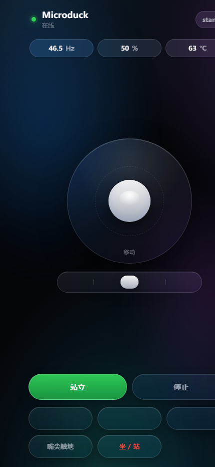

# web/ — 机器鸭 Web 控制台

> **打开地址:`http://10.5.90.195:8081/`**(手机同 WiFi 也行)
> 极简 iOS 26(液态玻璃)风格:状态 + 摇杆 + 动作 + 技能。零依赖(Python 标准库 + 单文件 HTML)。

## 截图

| | |
|---|---|
|  |  |
| 桌面端 | 手机端 |



## 部署位置

- K3:`/opt/microduck-k3/web/`(`server.py` + `index.html`),进程 `python3 server.py --port 8081`
- 本地源:本目录;改动后推上去即可(静态文件无需重启,`server.py` 改动要重启)

## 启动 / 停止(K3)

**已装成 systemd 服务**(崩溃自启,开机自启):

```bash
systemctl status duck-console      # 看状态
systemctl restart duck-console     # 重启(改 server.py 后)
journalctl -u duck-console -f      # 看日志
```

手动跑(调试用):
```bash
cd /opt/microduck-k3/web
setsid nohup python3 server.py --port 8081 </dev/null > /tmp/web.log 2>&1 &
pkill -f "[s]erver\.py --port 8081"      # 注意括号:否则 pkill 会匹配到自己这条命令
```

单元文件:本目录 `duck-console.service` → `/etc/systemd/system/`。

## 接口

| 方法 | 路径 | 说明 |
|---|---|---|
| GET | `/` | 控制台页面 |
| GET | `/api/state` | 状态:订阅流的 `robot.state`(policy/关节/摔倒)+ `robot.health`(Hz/电池/温度) |
| GET | `/api/skills` | 技能表(动态:`robot.skills` = 3 个表项 + 2 个 daemon 内建) |
| POST | `/api/move` | `{vx, vy, vyaw}` 连续意图 |
| POST | `/api/action` | `{action: rise\|stop\|relax\|enable\|disable\|init}` |
| POST | `/api/skill` | `{name}` → `robot.do` |

## 三个关键设计(都是踩出来的)

1. **移动意图由服务端以 20 Hz 转发**,不是浏览器直接打 daemon:服务端有 0.4 s TTL、
   daemon 有 500 ms deadman —— 手机息屏/WiFi 抖动/切后台,机器人都会自己停。
2. **`robot.state` 是订阅通知,不是可调方法**。直接 `robot.state` 会返回
   `unknown method`;必须 `robot.subscribe {hz:10}` 后用一条专用连接收
   `robot.state` 通知(服务端的 `StateFeed`)。
3. **`rise` 有两种形态**,选错就把鸭子放倒:
   - 开机坐姿检测中 → `robot.enable` + `robot.init`(坐姿起身走 sitstand,窗口 1 s);
   - 已经 `policy == "sit"`(有人按了坐/站)→ 再发 `sit_toggle`。
     此时 `robot.init` 会用**线性 ramp 重新归位**,把折叠的鸭子拖倒(实测过)。

## 实测(2026-09-08)

| 动作 | 结果 |
|---|---|
| 摇杆前进(vx=0.25 持续 4 s) | 鸭子前进 0.28 m 后停住站稳 |
| 技能「坐 / 站」 | policy sit,鸭子坐下(z 0.116→0.059) |
| 「站立」按钮(坐下后) | `sit_toggle` 起身 → policy stand,fallen=false |
| 页面加载 | 47–48 Hz / 电池 50% / CPU 63 °C 实时刷新 |

截图:`ui-phone.png`(500×950)、`ui-desktop.png`(900×1000)。
> 注:无头 Chrome 强制最小窗口宽 500 px,按 430 截会看起来"被裁"——是截图工具假象,不是布局问题。

## 还没做(可选)

- 头部控制(`robot.head` / `robot.look`)与姿势(`robot.pose`)
- 状态里的关节角可视化(现在只显示了数字状态)
- 免 nohup 的 systemd unit(P2 与其它 daemon 一起做)
